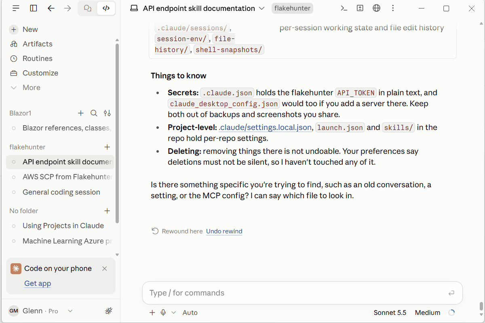
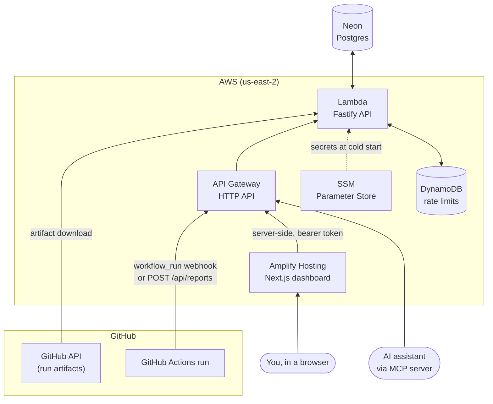
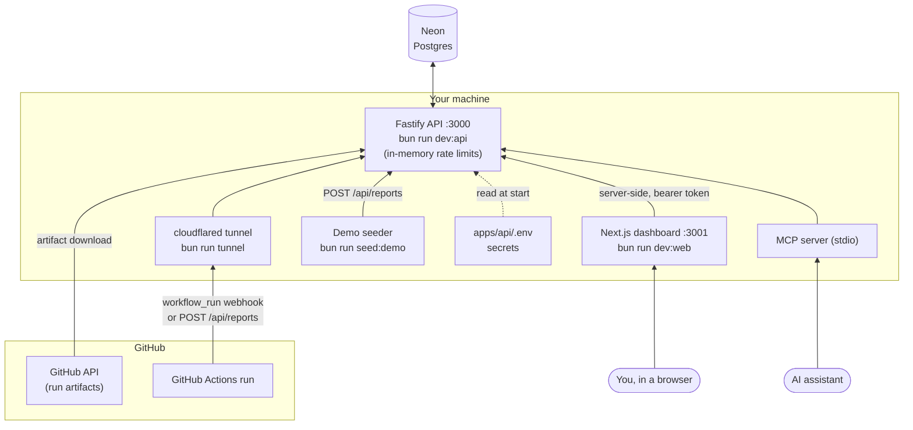

# FlakeHunter

**Find the flaky tests in your GitHub Actions CI: any test that both passes and fails on the same commit.**

**[Live demo](https://main.dcr99cldvce5a.amplifyapp.com/)** (password protected; [open an issue](https://github.com/glennmcd/flakehunter/issues) to
ask for access)

**The dashboard:** a repo's flakiest tests, then one test's pass/fail history.

**The MCP server:** ask your AI agent about your flaky tests.

## How it works

- **Collects** JUnit XML from your CI, either pulled from the workflow run's artifact by a GitHub webhook or pushed
  with one `curl` step.
- **Flags** a test as flaky when it has a pass and a fail on the same commit SHA, regardless of which workflow or job
  ran it. Same code, different result: no guessing from failure messages.
- **Ranks** tests by flake rate (flaky commits divided by commits the test ran on) in a dashboard and over an API,
  and answers an AI assistant's questions through an MCP server.

## Architecture

### Deployed on AWS

### Running locally

Locally, a quick tunnel gives GitHub a public URL for the API, so no cloud resources are involved apart from the Neon
database. FlakeHunter's own unit tests need none of this: they run against in-memory PGlite.

## Stack

A TypeScript monorepo built with Bun:

- **API:** Fastify (`apps/api`)
- **Dashboard:** Next.js 16 and React 19 (`apps/web`)
- **MCP server:** `packages/mcp-server`, for AI assistants
- **Shared types:** Zod schemas used by both the API and the dashboard (`packages/shared-types`)
- **Database:** Postgres (Neon for dev and production, in-memory PGlite for tests, so tests need no database or
  network)
- **Infrastructure:** AWS CDK (`infra/`)

## Security

Security best practices were used including but not limited to:

- Authorization required at all levels and external hooks  
- No secrets in code
- Data is schema validated and size limited
- AWS deployment specifies rate limiters, explicit SCP, kill switch, cost protection

The full list, the known gaps and how to report a vulnerability are in [docs/SECURITY.md](docs/SECURITY.md).

## Get started

- [Run it locally or deploy it to AWS](docs/deployment.md)
- [Send reports from CI, and the API reference](docs/api.md)
- [Use it from an AI assistant (MCP server)](packages/mcp-server/README.md)
- [AWS Organization guardrails (SCPs)](infra/scp/README.md)

## How I built this with Claude Code

FlakeHunter was built with [Claude Code](https://claude.com/claude-code). The project files that shaped how it worked:

- [`CLAUDE.md`](CLAUDE.md): the project's memory. Commands, architecture and the conventions that once caused bugs
  (route prefixes, extensionless imports, Node rather than Bun for CDK), so each session starts with what earlier
  ones learned.
- [`.claude/skills/new-endpoint`](.claude/skills/new-endpoint/SKILL.md): a skill for adding an `/api` endpoint
  test-first, so every route follows the same schema, registration and test steps.
- [`.claude/agents/code-reviewer.md`](.claude/agents/code-reviewer.md): a read-only reviewer for finished changes, so
  correctness and test gaps are checked by a fresh context that didn't write the code.
- [`.claude/agents/security-auditor.md`](.claude/agents/security-auditor.md): a read-only security audit for changes
  to auth, input handling, the database or dependencies, the parts an attacker reaches first.
- [`.claude/settings.json`](.claude/settings.json): a guardrail that denies `git commit`, so every change
  waits for my review and I make every commit myself.
- [`.claude/launch.json`](.claude/launch.json): the API and dashboard dev servers, so Claude Code can start them and
  check UI changes in its browser preview.

**Design notes:** each part was planned before any code was written. The [build plans](docs/plans/README.md) give the
prompt, the plan and what shipped for each part, and the [decision records](docs/decisions/README.md) explain the
choices behind them.

## License

[MIT](LICENSE).
