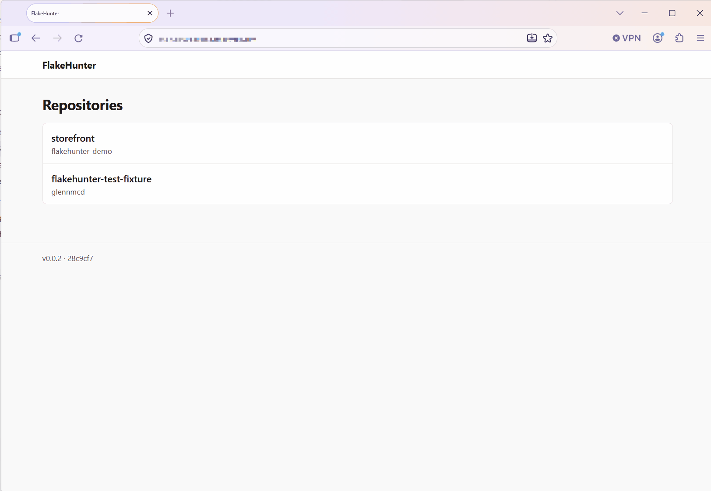
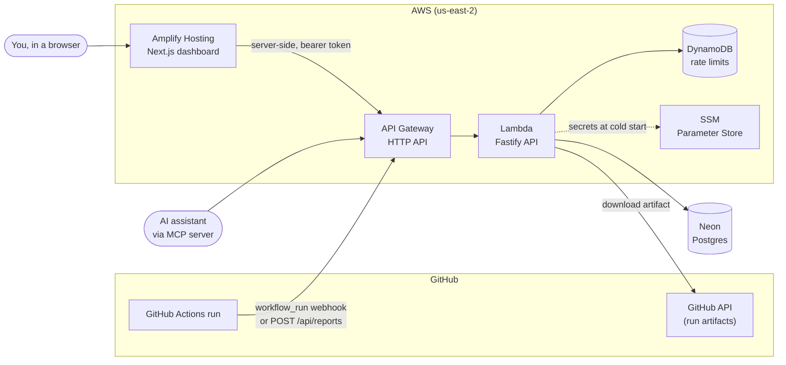
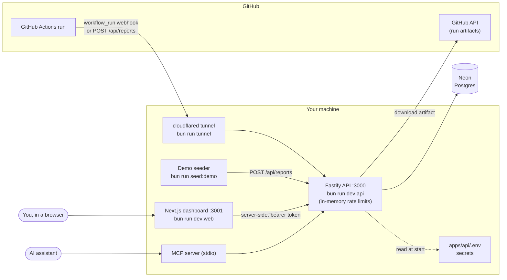

# FlakeHunter

**Find the flaky tests in your GitHub Actions CI: any test that both passes and fails on the same commit.**

<!-- TODO: replace <demo-url> with the dashboard's SiteUrl output or custom domain -->
**[Live demo](<demo-url>)** (password protected; [open an issue](https://github.com/glennmcd/flakehunter/issues) to
ask for access)

## How it works

- **Collects** JUnit XML from your CI, either pulled from the workflow run's artifact by a GitHub webhook or pushed
  with one `curl` step.
- **Flags** a test as flaky when it has a pass and a fail on the same commit SHA, regardless of which workflow or job
  ran it. Same code, different result: no guessing from failure messages.
- **Ranks** tests by flake rate (flaky commits divided by commits the test ran on) in a dashboard and over an API,
  and answers an AI assistant's questions through an MCP server.

## Architecture

### Deployed on AWS

### Running locally

Locally, a quick tunnel gives GitHub a public URL for the API, so no cloud resources are involved apart from the Neon
database. Tests need none of this: they run against in-memory PGlite.

## Stack

A TypeScript monorepo built with Bun:

- **API:** Fastify (`apps/api`)
- **Dashboard:** Next.js 16 and React 19 (`apps/web`)
- **MCP server:** `packages/mcp-server`, for AI assistants
- **Shared types:** Zod schemas used by both the API and the dashboard (`packages/shared-types`)
- **Database:** Postgres (Neon for dev and production, in-memory PGlite for tests, so tests need no database or
  network)
- **Infrastructure:** AWS CDK (`infra/`)

## Get started

- [Run it locally or deploy it to AWS](docs/deployment.md)
- [Send reports from CI, and the API reference](docs/api.md)
- [Use it from an AI assistant (MCP server)](packages/mcp-server/README.md)
- [AWS Organization guardrails (SCPs)](infra/scp/README.md)

## License

[MIT](LICENSE).
